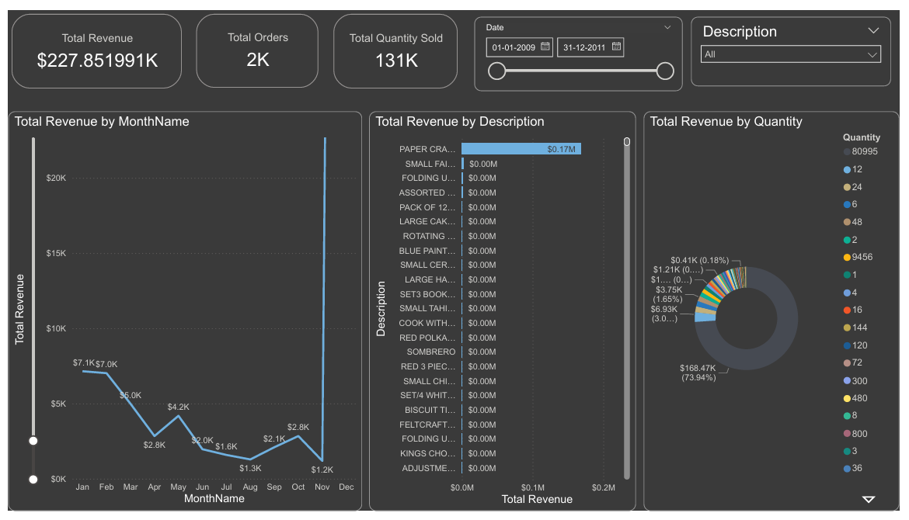
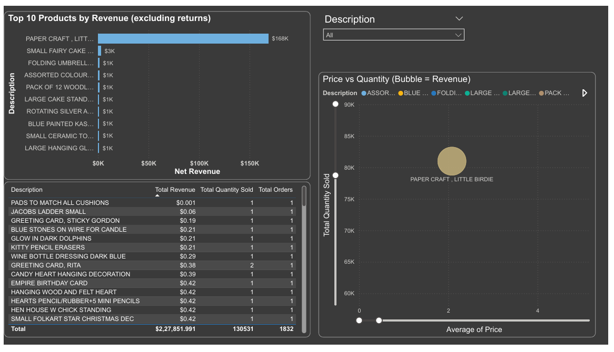
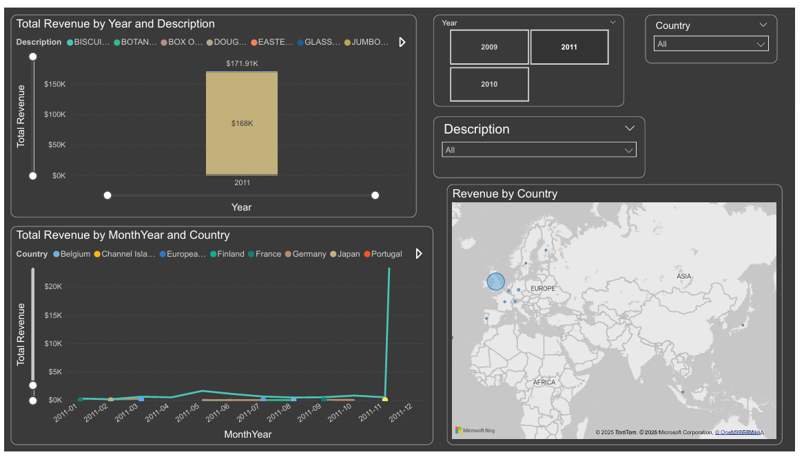

# FUTURE_DS_01
Sales Analysis - POWER BI 

<h1>OBJECTIVE:</h1>
To analyze the data and put together a report to help the company to drive more sales and work more efficiently.

DATASET:

QUESTIONS:
1.) What are the best-selling products? 
2.) When do sales peak during the year? 
3.) Which categories or regions bring the most revenue? 

DASHBOARD:

FINDINGS:

<OL>
  <LI>Generated $227K revenue from 2K orders and 131K+ items sold</LI>
  <LI>Identified top-performing product (Paper Craft, Little Birdie) contributing $168K+ alone</LI>
  <LI>Found strong seasonal peaks in January & November, reflecting customer demand cycles</LI>
  <LI>Discovered that a few SKUs drive the majority of sales (Pareto principle in action)</LI>
  <LI>Visualized revenue by country to highlight key European marketS</LI>
</OL>

